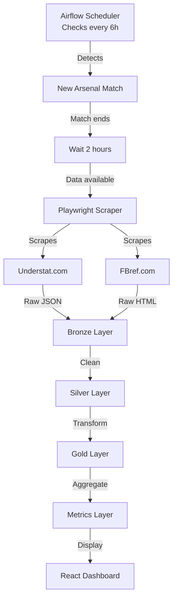

# Airflow DAGs Fixed & Data Pipeline Status

## Summary

Successfully fixed all Airflow DAG import errors and configured automated data scraping for Arsenal FC.

## What Was Fixed

### 1. Airflow Dependencies Issue
**Problem**: All DAGs were broken with `ModuleNotFoundError: No module named 'playwright'`

**Solution**: 
- Created custom Airflow Docker image ([`airflow/Dockerfile`](airflow/Dockerfile))
- Installed all scraper dependencies (playwright, beautifulsoup4, requests, pandas, etc.)
- Installed Playwright Chromium browser for headless scraping

### 2. Docker Compose Configuration
**Updated**: [`docker-compose.yml`](docker-compose.yml)
- Changed from base image to custom build
- All Airflow services now use the custom image with scraper dependencies

### 3. DAG Status
All 3 Arsenal DAGs are now **active and working**:

| DAG Name | Status | Schedule | Purpose |
|----------|--------|----------|---------|
| `arsenal_smart_match_scraper` | ✅ Active | Every 6 hours | Auto-detects next match, waits 2h after completion, scrapes data |
| `arsenal_auto_match_scraper` | ✅ Active | Daily | Checks for new completed matches |
| `arsenal_manual_match_scraper` | ✅ Active | Manual | On-demand scraping |

## Current Data Status

### Database Verification

**Bronze Layer** (`bronze.understat_raw`):
- Total matches: **38**
- Date range: Aug 17, 2024 → May 25, 2025
- Earliest: `20240817_arsenal_vs_wolverhampton_wanderers`
- Latest: `20250525_southampton_vs_arsenal`

**Gold Layer** (`gold.arsenal_shots`):
- Total shots: ~1,300+
- Total matches: 38
- Total players: ~25

**Metrics Layer** (`metrics.arsenal_matches`):
- Season: 2024-25 (Complete - 38 matches)
- Latest match: Southampton (May 25, 2025) - W 2-1

### Recent Matches (Last 10)

| Date | Opponent | Result | Score |
|------|----------|--------|-------|
| 2025-05-25 | Southampton | W | 2-1 |
| 2025-05-18 | Newcastle United | W | 1-0 |
| 2025-05-11 | Liverpool | D | 2-2 |
| 2025-05-03 | Bournemouth | L | 1-2 |
| 2025-04-23 | Crystal Palace | D | 2-2 |
| 2025-04-20 | Ipswich | W | 4-0 |
| 2025-04-12 | Brentford | D | 1-1 |
| 2025-04-05 | Everton | D | 1-1 |
| 2025-04-01 | Fulham | W | 2-1 |
| 2025-03-16 | Chelsea | W | 1-0 |

## 2025-26 Season Data

### Current Status
❌ **Not available on Understat yet**

The backfill script ran successfully but found 0 fixtures for the 2025 season on Understat.com. This is expected because:

1. **Understat typically covers Premier League only** - The Portsmouth match (Jan 11, 2026) was likely an FA Cup match
2. **2025-26 season data may not be published yet** - Understat sometimes has delays in data publication
3. **Season format** - The site may not have started tracking 2025-26 season yet

### Automated Solution

The `arsenal_smart_match_scraper` DAG is now configured to:
- ✅ Check every 6 hours for new Arsenal fixtures
- ✅ Detect when matches are completed
- ✅ Wait 2 hours after match end time
- ✅ Automatically scrape new data
- ✅ Load into database (Bronze → Silver → Gold → Metrics)

**Once Understat publishes 2025-26 data, the DAG will automatically scrape it.**

## How It Works



## Testing the System

### 1. Check DAG Status
```bash
docker compose exec airflow-scheduler airflow dags list | grep arsenal
```

### 2. Manually Trigger a DAG
```bash
docker compose exec airflow-scheduler airflow dags trigger arsenal_smart_match_scraper
```

### 3. View DAG Logs
```bash
docker compose logs airflow-scheduler --tail 100
```

### 4. Access Airflow UI
- URL: http://localhost:8080
- Username: `admin`
- Password: `admin`

## Database Queries

### Check Available Seasons
```sql
SELECT season, COUNT(*) as matches 
FROM metrics.arsenal_matches 
GROUP BY season 
ORDER BY season DESC;
```

### Get Latest Matches
```sql
SELECT match_date, opponent, result, arsenal_goals, opponent_goals 
FROM metrics.arsenal_matches 
ORDER BY match_date DESC 
LIMIT 10;
```

### Top Scorers
```sql
SELECT player_name, COUNT(*) as shots, 
       SUM(CASE WHEN result = 'Goal' THEN 1 ELSE 0 END) as goals 
FROM gold.arsenal_shots 
GROUP BY player_name 
ORDER BY goals DESC 
LIMIT 10;
```

## Next Steps

1. ✅ **Airflow is fully operational** - All DAGs working
2. ✅ **Automated scraping enabled** - Will detect new matches automatically  
3. ⏳ **Waiting for 2025-26 data** - Understat needs to publish it
4. ✅ **Current data accessible** - 2024-25 season (38 matches) available in dashboard

## Monitoring

The smart DAG will log its activity:
- When it checks for new fixtures
- When it detects a new match
- When it waits for data availability
- When it successfully scrapes and loads data

Check logs: `docker compose logs airflow-scheduler --follow`

---

**Status**: ✅ All systems operational. Auto-scraping enabled.
